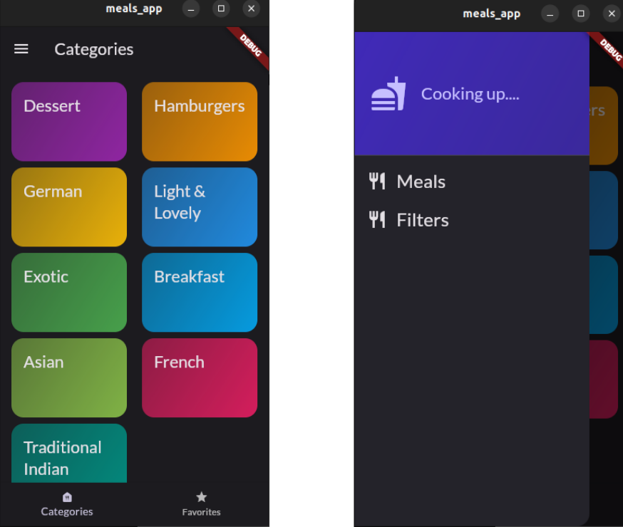
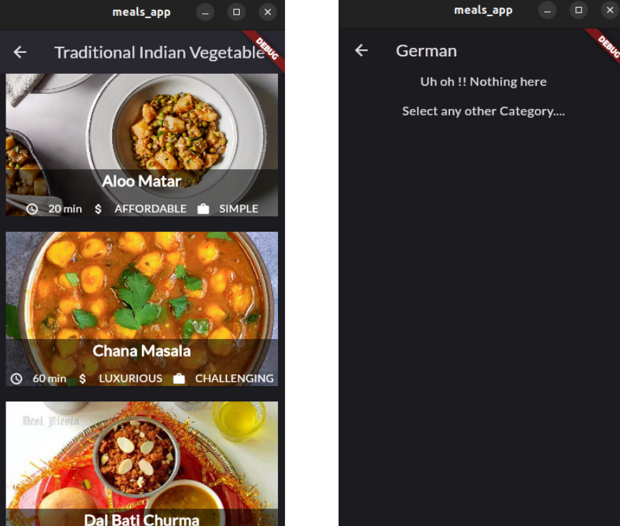
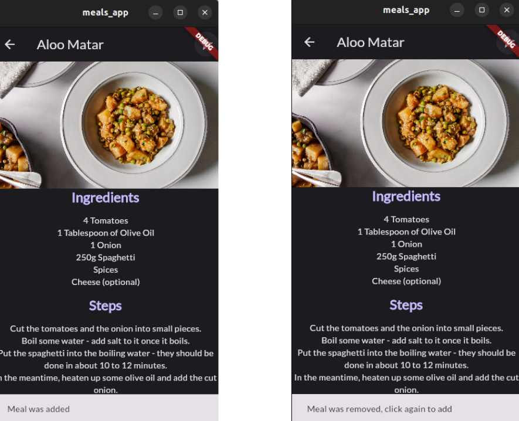
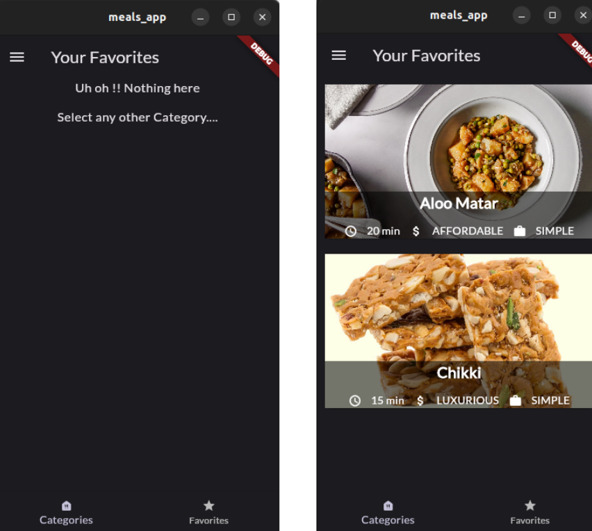
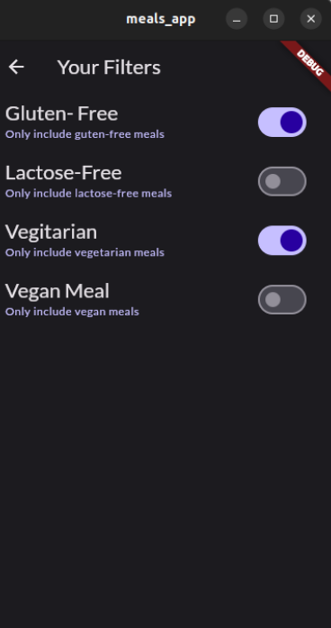

# Meals App

A new Flutter project.

## About the App

The "Meals App" is an Android and iOS mobile application developed using the Flutter framework and Dart programming language. Flutter is a robust, open-source mobile application
development framework that enables developers to create high-performance, visually attractive mobile applications with a single codebase. 

The application provides users with access to a vast range of meals, categorized based on their characteristics, including Lightweight, Quick,
Breakfast, French, etc. Users can explore various meal options and access detailed information about each meal, including ingredients, step-by-step instructions for preparing them, and nutritional information.

The application utilizes various features of Flutter, such as Navigation between multiple screens using Stacks, Bottom Navigation Bar, Side Drawer, Filters, and many more. These features offer an intuitive, user-friendly interface that makes navigating through the app a breeze. Additionally, the app incorporates the Riverpod provider for efficient state management across the entire application.

Users can mark their favorite meals and revisit them with ease. They can also apply filters based
on their preferences, including dietary restrictions, ingredients, and meal types, among others.
The app provides users with the ability to customize their meal preferences and offers them
suggestions based on their selected filters.

## Glimpse of all the sections of the app

* **Home Screen**
  
  
  

* **Categories ( It shows all the food categories available for the user to choose).**
  
  
  

* **Recipe Screen(It shows the complete recipe when a user click on any food item)**
  
  
  

* **Favorites Screen(When a user marks any recipe as favorite it would appear here, to remove it the star button again need to be clicked in the recipe screen)**

  
  

* **Filters(It allows the users to apply filters and display food items accordingly. It can be opened by clicking on Filters Button in the side drawer)**
  
  

